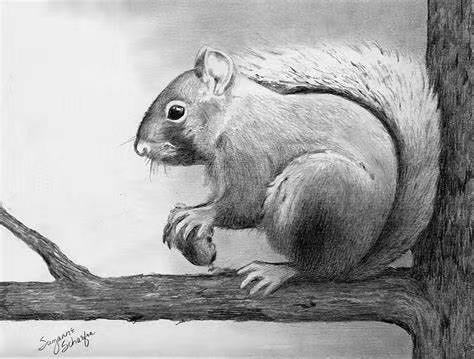
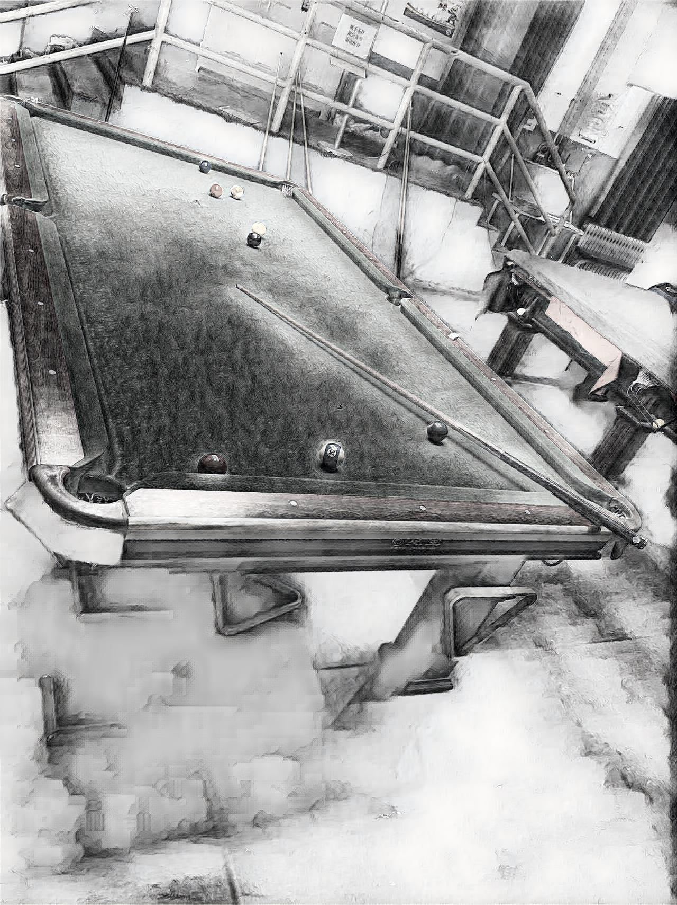

# fast_neural_style 快速神经网络实现图像风格化
---
## 概述
该存储库包含用于**艺术风格转移的算法**的 PyTorch 实现。该算法能够将**图像的内容与另一图像的样式混合**，实现图像风格化迁移。模型采用了实时风格传输、超分辨率的感知损失以及实例归一化等技术。

相关论文：**Perceptual Losses for Real-Time Style Transfer and Super-Resolution** [论文链接](https://arxiv.org/abs/1603.08155)

实现效果展示：
<p align="center">
    
    
    
</p>

## 模型依赖
该程序使用 Python 编写，主要依赖 PyTorch 库。请确保本地运行环境可以正常运行 PyTorch。GPU 虽然不是必需的，但可以显著提高处理速度。如果您只使用已训练好的模型权重进行测试，可以不使用 GPU，但在训练新模型时，建议使用高性能 GPU 以提高训练速度。

### 依赖包安装
请使用以下命令安装所需依赖包：

```shell
pip install -r requirements.txt
```

`requirements.txt` 文件内容如下：

```
torch>=1.8.1
torchvision>=0.9.1
numpy>=1.21.0
Pillow>=8.2.0
```

## 用法
### 注意事项
- 项目中已提供一些训练好的模型权重，存放在 `new_saved_model` 文件夹中。
- 我们使用 COCO 2014 训练数据集，下载后将数据放在一个文件夹下，例如 `train/train2014`。

### 风格化图像
```shell
python neural_style/neural_style.py eval --content-image </path/to/content/image> --model </path/to/saved/model> --output-image </path/to/output/image> --cuda 0
```

参数说明：
- `--content-image`: 要风格化的内容图像的路径。
- `--model`: 已保存的模型，用于风格化图像。
- `--output-image`: 保存输出图像的路径。
- `--content-scale`: 若内存不足，用于缩小内容图像的系数（如：值为 2 将使内容图像的高度和宽度减半）。
- `--cuda`: 设置为 1 在 GPU 上运行，设置为 0 在 CPU 上运行。
- `--mps`: 设置为 1 在 macOS GPU 上运行。

### 训练模型
```shell
python neural_style/neural_style.py train --dataset </path/to/train-dataset> --style-image </path/to/style/image> --save-model-dir </path/to/save-model/folder> --epochs 2 --cuda 1
```

重要参数说明：
- `--dataset`: 训练数据集的路径，应指向包含所有训练图像的文件夹。
- `--style-image`: 样式图像的路径。
- `--save-model-dir`: 保存训练模型的文件夹路径。
- `--cuda`: 设置为 1 在 GPU 上运行，设置为 0 在 CPU 上运行。
- `--mps`: 设置为 1 在 macOS GPU 上运行。

更多命令行参数请参阅 `neural_style/neural_style.py`。训练新模型时，可能需要调整 `--content-weight 1e5` 和 `--style-weight 1e10` 的值。现有的风格化模型是用 `--content-weight 1e5` 和 `--style-weight 1e10` 训练的。其他三个模型使用相似的权重参数顺序进行训练，但 `--style-weight`（`5e10` 或 `1e11`）略有变化。

## 使用 Jupyter Notebook 进行可视化输出
在 `neural_style` 文件夹下有一个 `neural_style_comments.ipynb` 文件，可以直接通过函数调用完成风格化迁移与训练，而不需要使用命令行参数，更加方便。

## Web Demo
对于已训练好的模型，我们提供了一个简单的网页端部署。可以在 `web-demo` 文件夹下查看，进入该文件夹后使用以下命令：
```shell
python app.py
```
然后在本地浏览器中打开网页。