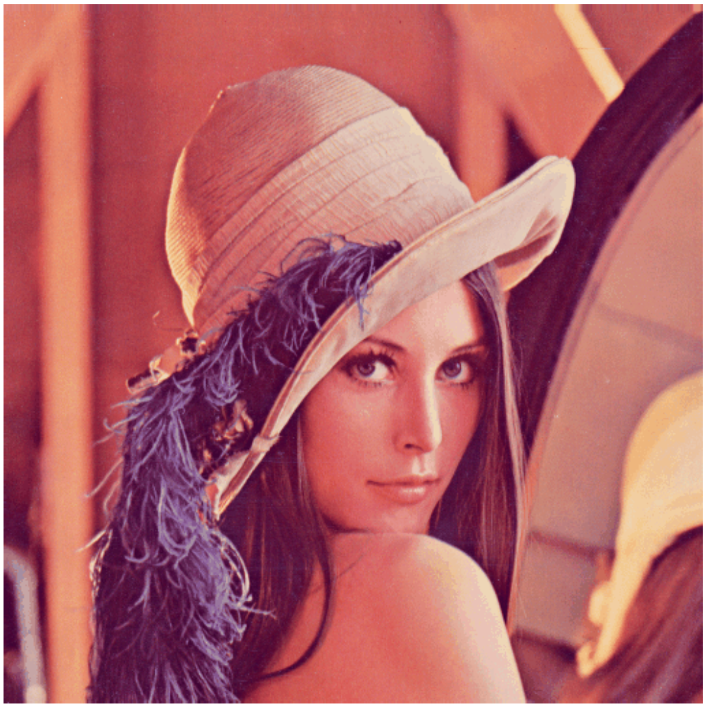

# fast_neural_style 快速神经网络实现图像风格化
---
## 概述
该存储库包含用于**艺术风格转移的算法**的 pytorch 实现。该算法可用于将**图像的内容与另一图像的样式混合**。实现图像风格化迁移。
该模型使用实时风格传输和超分辨率的感知损失以及实例归一化中所述的方法。
**Perceptual Losses for Real-Time Style Transfer and Super-Resolution**  论文地址：https://arxiv.org/abs/1603.08155

实现效果：
<p align="center">
    
    
    
</p>

## 模型依赖
该程序是用 Python 编写的，主要依赖pytorch库，请保证本地运行环境可以正常运行pytorch。
GPU 不是必需的，但可以显着提高速度。如果你只是使用已训练好的模型权重进行测试，可以不适用GPU，但是在训练新模型时，我们建议你能有一个性能优秀的GPU来提高训练速度。
该项目可以使用保存的模型在笔记本电脑或台式机上设置任意尺寸的图像样式。

## 用法
注意：
* 在这个项目中，我们已经为您保存好一些训练好的权重数据，可以参见 ```/saved_models```这个文件夹。
* 同样我们也为您下载好了coco2014作为训练数据集，放在```/train```这个文件夹下，可以在训练中直接调用

**风格化图像**
```shell
python neural_style/neural_style.py eval --content-image </path/to/content/image> --model </path/to/saved/model> --output-image </path/to/output/image> --cuda 0
```
- `--content-image`: 要样式化的内容图像的路径。
- `--model`: 保存的模型，用于样式化图像
- `--output-image`: 用于保存输出图像的路径
- `--content-scale`:如果内存不足，则用于缩小内容图像的系数（例如：值为 2 将使内容图像的高度和宽度减半）
- `--cuda`: 设置为 1 以在 GPU 上运行，设置为 0 以 CPU 运行。
- `--mps`: 将其设置为 1 以在 macOS GPU 上运行

**训练模型**
```shell
python neural_style/neural_style.py train --dataset </path/to/train-dataset> --style-image </path/to/style/image> --save-model-dir </path/to/save-model/folder> --epochs 2 --cuda 1
```
有几个命令行参数，下面列出了重要的参数
* --dataset ：训练数据集的路径，则该路径应指向包含包含所有训练图像的另一个文件夹的文件夹。我使用了 COCO 2014 训练图像数据集。
* --style-image ：样式图像的路径。
* --save-model-dir ：将保存训练模型的文件夹的路径。
* --cuda ：设置为 1 以在 GPU 上运行，设置为 0 以 CPU 运行。
* --mps ：将其设置为 1 以在 macOS GPU 上运行

有关其他命令行参数，请参阅 `neural_style/neural_style.py` 。要训练新模型，可能需要调整 `--content-weight 1e5` 和 `--style-weight 1e10` 的值。已有的风格化模型是用 `--content-weight 1e5` 和 `--style-weight 1e10` 训练的。其余 3 个模型也使用相似的权重参数顺序进行训练， 但是`--style-weight`（`5e10` 或 `1e11` ） 略有变化。


**一些保存的命令**
```shell
 python neural_style/neural_style.py train --dataset train --style-image images/style_images/vangao.jpg --save-model-dir ~/new-model-saved --epochs 2 --cuda 1

 python neural_style/neural_style.py eval --content-image /home/yuwenhan/image_enhance/fast_neural_style/images/content_images/lenna.png --model /home/yuwenhan/image_enhance/fast_neural_style/new_saved_models/Monet.model --output-image /home/yuwenhan/image_enhance/fast_neural_style/images/output_images/lenna.jpg --cuda 0

 python neural_style/neural_style.py eval --content-image images/content_images/amber.jpg --model new_saved_models/Monet.model --output-image images/output_images/amber-monet.jpg --cuda 1
 ``` 
